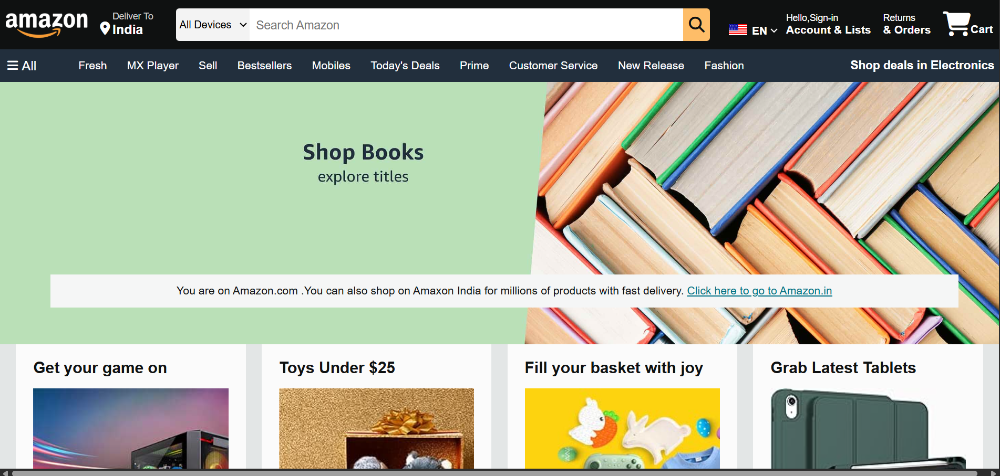
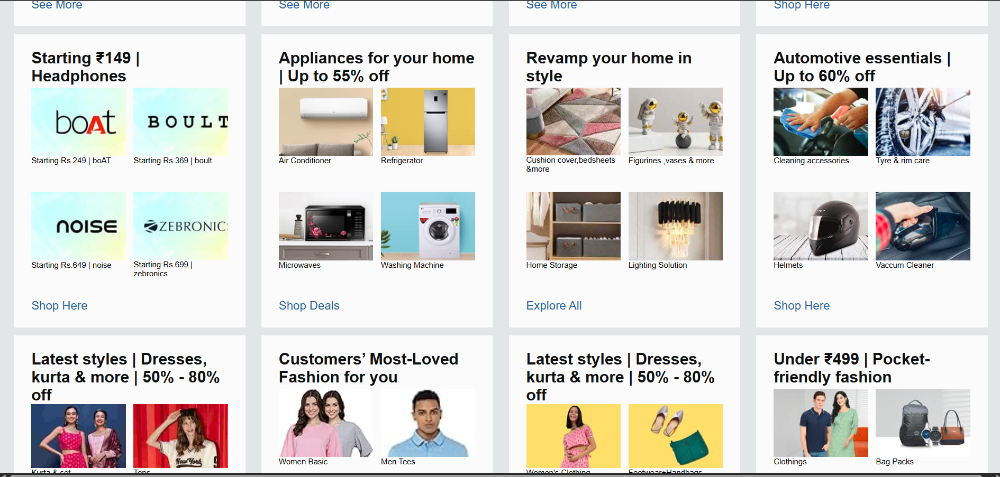
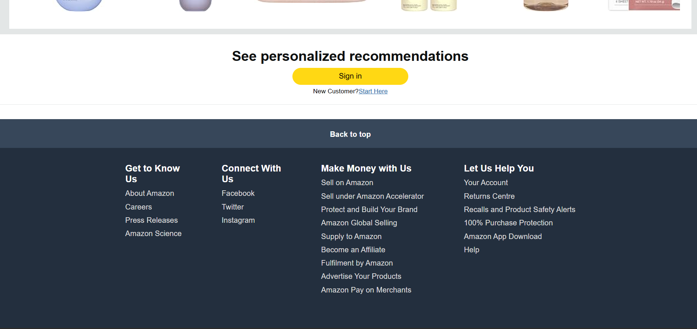
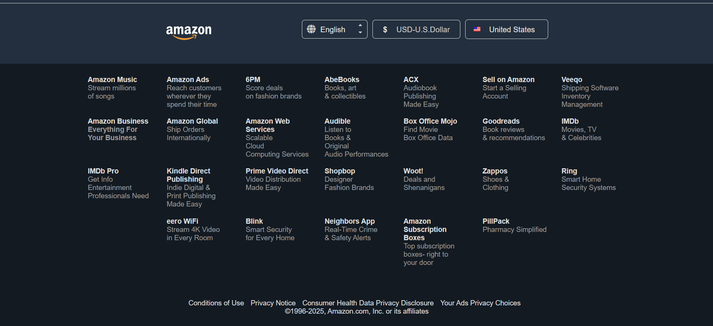

# 🛒 Amazon Front Page Clone

This is a **clone of the Amazon front page** built using **HTML** and **CSS** only. It replicates the layout, design, and basic visual elements of the Amazon homepage to practice frontend development skills.

## 📌 Features

- Responsive layout (optional if you've implemented it)
- Navigation bar with logo and search
- Product sections with images
- Footer design similar to Amazon

## 🚀 Technologies Used

- HTML5
- CSS3

## 📸 Screenshot
### 🖼️ Screenshot 1 – Start Page View
 

### 🖼️ Screenshot 2 – Content Section
 

### 🖼️ Screenshot 3 – Footer
 

### 🖼️ Screenshot 4 – Footer
 

## 📝 Author

- [Avanti Chinchone](https://github.com/Avanti-Chinchone2003)

